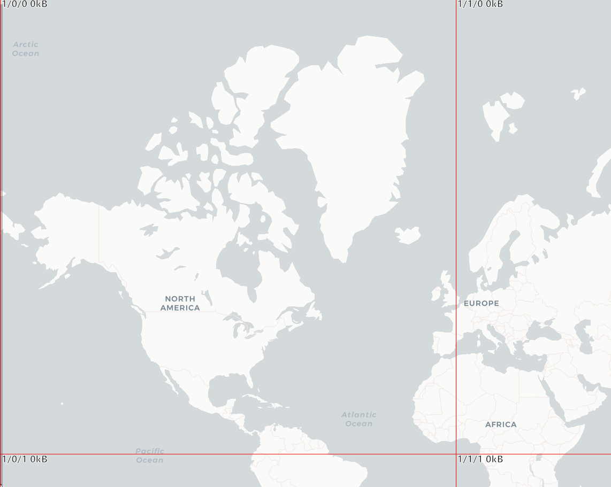
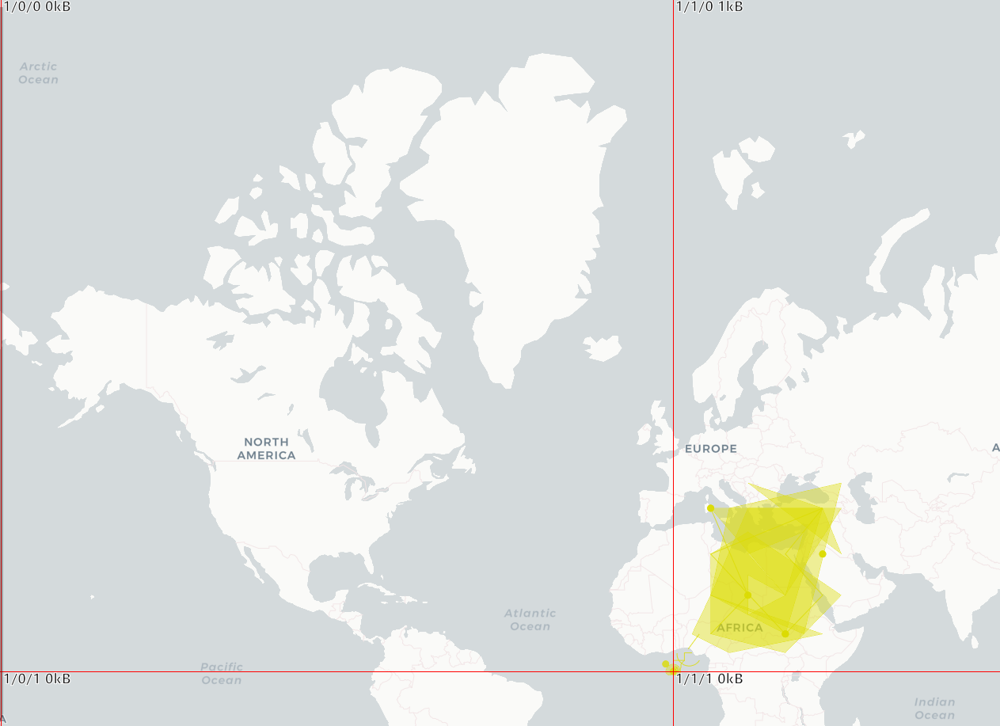

## 阅读提示

**本文写作耗时1小时，预计阅读时间： 1分钟**

## Bug描述
PostGIS在3.5.0以下版本， 进行动态矢量切片时，返回的数据有丢失。

### 3.5以下版本（有丢失）



### 3.5以上版本（完整）



## Bug 复现

1. 使用Docker 分别启动 3.5 以下和以上版本两个PostGIS数据库。

2. 使用该sql注入测试数据。

```sql
DROP TABLE IF EXISTS table_source;
CREATE TABLE table_source(gid serial PRIMARY KEY, geom geometry(GEOMETRY, 4326));

INSERT INTO table_source(geom) values (GeomFromEWKT('SRID=4326;POINT(0 0)'));
INSERT INTO table_source(geom) values (GeomFromEWKT('SRID=4326;POINT(-2 2)'));
INSERT INTO table_source(geom) values (GeomFromEWKT('SRID=4326;LINESTRING(0 0, 1 1)'));
INSERT INTO table_source(geom) values (GeomFromEWKT('SRID=4326;LINESTRING(2 2, 3 3)'));

INSERT INTO table_source(geom) values (GeomFromEWKT('SRID=4326;POINT(30 10)'));
INSERT INTO table_source(geom) values (GeomFromEWKT('SRID=4326;LINESTRING(30 10, 10 30, 40 40)'));
INSERT INTO table_source(geom) values (GeomFromEWKT('SRID=4326;POLYGON((30 10, 40 40, 20 40, 10 20, 30 10))'));
INSERT INTO table_source(geom) values (GeomFromEWKT('SRID=4326;POLYGON((35 10, 45 45, 15 40, 10 20, 35 10),(20 30, 35 35, 30 20, 20 30))'));
INSERT INTO table_source(geom) values (GeomFromEWKT('SRID=4326;MULTIPOINT((10 40), (40 30), (20 20), (30 10))'));
INSERT INTO table_source(geom) values (GeomFromEWKT('SRID=4326;MULTIPOINT(10 40, 40 30, 20 20, 30 10)'));
INSERT INTO table_source(geom) values (GeomFromEWKT('SRID=4326;MULTILINESTRING((10 10, 20 20, 10 40),(40 40, 30 30, 40 20, 30 10))'));
INSERT INTO table_source(geom) values (GeomFromEWKT('SRID=4326;MULTIPOLYGON(((30 20, 45 40, 10 40, 30 20)),((15 5, 40 10, 10 20, 5 10, 15 5)))'));
INSERT INTO table_source(geom) values (GeomFromEWKT('SRID=4326;MULTIPOLYGON(((40 40, 20 45, 45 30, 40 40)),((20 35, 10 30, 10 10, 30 5, 45 20, 20 35),(30 20, 20 15, 20 25, 30 20)))'));
INSERT INTO table_source(geom) values (GeomFromEWKT('SRID=4326;GEOMETRYCOLLECTION(POINT(4 6),LINESTRING(4 6,7 10))'));
INSERT INTO table_source(geom) values (GeomFromEWKT('SRID=4326;CIRCULARSTRING(1 5, 6 2, 7 3)'));
INSERT INTO table_source(geom) values (GeomFromEWKT('SRID=4326;COMPOUNDCURVE(CIRCULARSTRING(0 0,1 1,1 0),(1 0,0 1))'));
INSERT INTO table_source(geom) values (GeomFromEWKT('SRID=4326;CURVEPOLYGON(CIRCULARSTRING(-2 0,-1 -1,0 0,1 -1,2 0,0 2,-2 0),(-1 0,0 0.5,1 0,0 1,-1 0))'));
INSERT INTO table_source(geom) values (GeomFromEWKT('SRID=4326;MULTICURVE((5 5,3 5,3 3,0 3),CIRCULARSTRING(0 0,2 1,2 2))'));

INSERT INTO table_source(geom) values (GeomFromEWKT('SRID=4326;POINT(142.84124343269863 11.927545216212339)'));
INSERT INTO table_source(geom) values (GeomFromEWKT('SRID=4326;POINT(142.84022627741408 11.926919775099435)'));
INSERT INTO table_source(geom) values (GeomFromEWKT('SRID=4326;POINT(142.84116724279622 11.926986082398354)'));
INSERT INTO table_source(geom) values (GeomFromEWKT('SRID=4326;POINT(142.84129834730146 11.926483025982757)'));
INSERT INTO table_source(geom) values (GeomFromEWKT('SRID=4326;POINT(142.84086326293937 11.92741281580712)'));
INSERT INTO table_source(geom) values (GeomFromEWKT('SRID=4326;POINT(142.84083973422645 11.927188724740008)'));
INSERT INTO table_source(geom) values (GeomFromEWKT('SRID=4326;POINT(142.8407405154705 11.92659842381238)'));
INSERT INTO table_source(geom) values (GeomFromEWKT('SRID=4326;POINT(142.84029057105903 11.92711170365923)'));
INSERT INTO table_source(geom) values (GeomFromEWKT('SRID=4326;POINT(142.8403402985401 11.927568375227375)'));
INSERT INTO table_source(geom) values (GeomFromEWKT('SRID=4326;POINT(142.84131509869133 11.92781306544329)'));
```

3. 在两个版本的数据库上分别执行以下查询语句，观察并对比当z x y 分别 `1 1 1` 和 `1 1 0` 时的结果.

```sql
SELECT
      ST_AsMVT(tile, 'table_source', 4096, 'geom')
    FROM (
      SELECT
        ST_AsMVTGeom(
            ST_Transform(ST_CurveToLine("geom"::geometry), 3857),
            ST_TileEnvelope($1::integer, $2::integer, $3::integer),
            4096, 64, true
        ) AS geom
        , "gid"
      FROM
        "public"."table_source"
      WHERE
        "geom" && ST_Transform(ST_TileEnvelope($1::integer, $2::integer, $3::integer, margin => 0.015625), 4326)
      
    ) AS tile;

```

4. 结果如下：

| z   | x   | y   | pg_version(docker image) | source       | st_asmvt         | is_empty |
| --- | --- | --- | ------------------------ | ------------ | ---------------- | -------- |
| 1   | 1   | 1   | `postgis/postgis:14-3.3` | table_source | (BLOB) 2 bytes   | yes      |
| 1   | 1   | 0   | `postgis/postgis:14-3.3` | table_source | (BLOB) 2 bytes   | yes      |
| 1   | 1   | 1   | `postgis/postgis:14-3.5` | table_source | (BLOB) 607 bytes | no       |
| 1   | 1   | 0   | `postgis/postgis:14-3.5` | table_source | (BLOB) 1.18 KB   | no       |


## Bug现状

已经报告给PostGIS团队，建议大家尽快升级到3.5以上版本。Bug跟踪地址：https://trac.osgeo.org/postgis/ticket/5836


## 联系作者 

**XD**, Email: zhangyijunmetro@hotmail.com 

